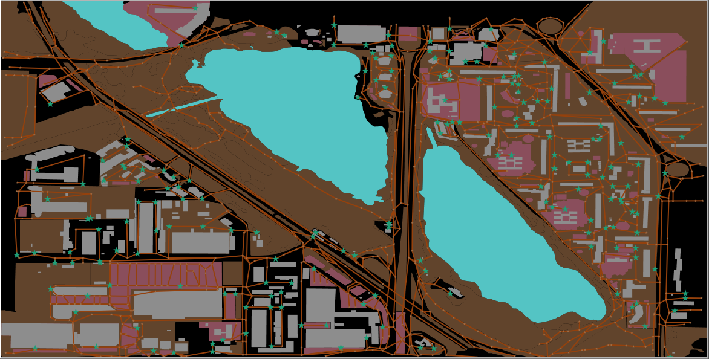
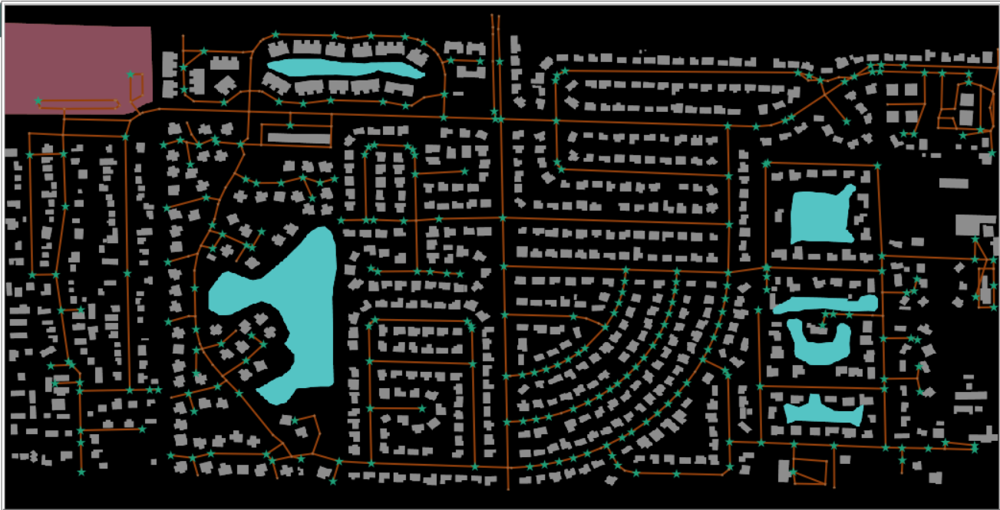
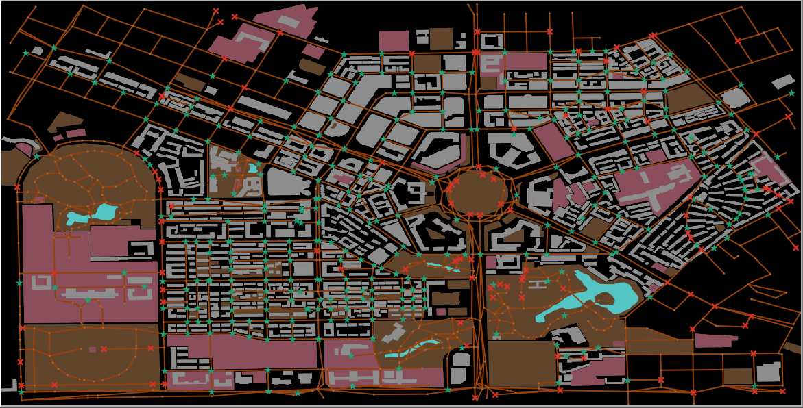
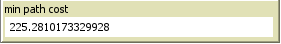

# Apply Search Strategies to Netlogo

## 1. Introduction

- In [Netlogo](https://ccl.northwestern.edu/netlogo), we imitate the reality maps in the world by [GIS Extension](https://github.com/NetLogo/GIS-Extension) support by Netlogo. 
To simplify the maps, we only display some important entity such as 
    - land: 
    - water: 
    - buildings: 
    - roads: 
    - junction:  

- We apply search strategies to find the way to home for anonymous peoples and help them go back home as fast as possible

## 2. Implementation

- We need to find some location in [Open Street Map](https://openstreetmap.org), export and convert `file.osm` to `file.shp` and import them to Netlogo throw GIS Extension. Let compare the map which we imported to Netlogo and the map in open street map:
- To see more about map key , click [here](map_key.md)

> District 5, Ho Chi Minh, Viet Nam:  
Around areas  
  
Areas  
  
Netlogo  
  

 

> Kyiv capital, Ukraine:  
Around areas  
  
Areas  
  
Netlogo   
  

 

> Tokyo, Japan:  
Around areas  
  
Areas  
  
Netlogo  
  

 

> Florida, American:  
Around areas  
  
Areas  
  
Netlogo  
  

 

> Changchun, China:  
Around areas  
  
Areas  
  
Netlogo  
  

 

- We create 3 file with 3 level to operate easier. In 2 last level, we wanna find path in traffic jam situation. People have to avoid junctions where happen the jam 

- Apply search strategies include `Greedy Best First Search`, `A*`, `Uniform Cost Search`, `Breadth First Search`, `Depth First Search`.  wanna go to . They find path by these search strategies: 
    - GBFS:  
    - A*:  
    - UCS:   
    - BFS:  
    - DFS: 

- Some utility button:
    > Chose map which we imported: 

    > Chose probability for the happening of rush-hours at one junction: 

    > Imitate reality map which you have chosen: 

    > Chose delay when you observe the agents: 

    > Randomly create people: 

    > Randomly create destination: 

    > Focus one people: 

    > Unfocus one people: 

    > Find path by search strategies respectively:   

    > Count number of people which arrived home: 

    > People have min path cost to home and his strategy:   
    >   You can also focus on him: 

    > Clear all path: 

    > Chose what strategy you want to go back home: 

    > Go home when you applied one of search strategies: 

- Level 3 we specially add the plot which compare the number of nodes in frontier of agents. It can help you to observe `time consuming` as well as how much `memory` which algorithms use  

    

