# Map key color 🌃

### polygon:  

- land: 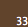
- water: 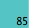
- amenity buildings: 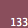
- buildings: 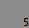

### line:  

- roads: 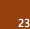

- path used in search strategies:
    - GBFS: 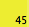 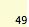
    - A*: 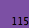 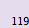
    - UCS: 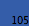 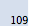
    - BFS: 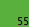 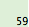
    - DFS: 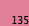 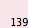

### point:  

- destination (home): 
- agent (people): 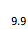
- entrance (entrance of each perspective building): 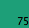
- jam (intersection which in rush hours): 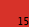

