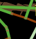

# 🗺 Map key 

> ### polygon  

- land:  
- water:  
- amenity buildings:  
- buildings:  

> ### line  

- roads:  

- path used in search strategies:
    - GBFS:   

    - A*:   

    - UCS:   

    - BFS:   

    - DFS:   

> ### point  

- junction:   
- destination (home):   
- agent (people):  
- entrance (entrance of each perspective building):  
- jam (junction which in rush hours):  

